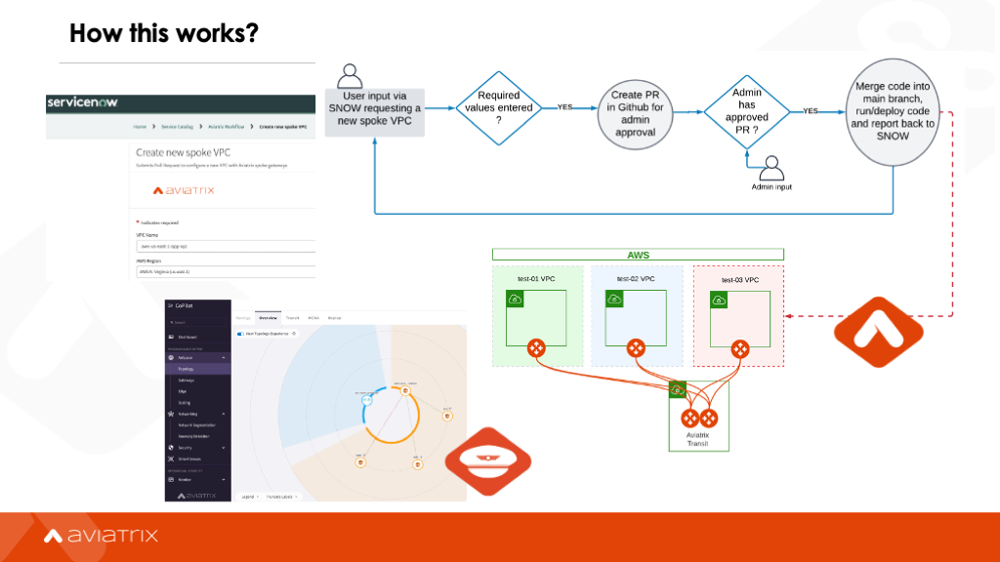

# Gainwell's Buildathon BAT7 Repository
Aviatrix repository for Gainwell's buildathon

  * This Github repo: https://github.com/aviatrix-automation/gainwell_bat7

## Purpose and context:
Having multiple automation control planes for different types of infrastructure and different types of network functions renders it more difficult to provide interconnected automations that maintain consistency across layers.

It also makes it really hard to automatically adapt interrelated layers when one of them changes. Workflow automation strives to enable us in bringing all the declarative, active reconciliation benefits to the entire stack, truthfully end to end to end: automating the automation.

## What is the Aviatrix Workflow solution for Gainwell's BAT7:

### Constraints:
  - CSP agnostic with differences only in initial deployment.
  - Ability to be integrated into Aviatrix platform in the long run.
  - Minimize compute cost with server-less options.
  - Trigger workflows based on events or schedule.

### System Environment:
Each component is a separate docker container in order to allow the workflow infrastructure to exist on any CSP.
The services leveraged to run each container are described below. Currently only AWS is supported.
  - Longer running components on Fargate, >= 15 mins
  - Ephemeral components on Lambda, < 15 mins

### The Architecture:
This architecture is composed of 3 main components: the Workflow client library, the Workflow Manager, and the Workflow Engine.

#### Workflow Engine:
This is the backend of the solution and what actually runs each workflow.

#### Workflow Manager:
This is the core component of workflow automation, it acts as a proxy for the workflow Engine and as a manager of the various workflows required to be run.  The Manager abstracts away any details of the Engine and is agnostic as to where it is being run.
  - Interacts with the Workflow Engine, creating/running/updating/deleting workflows.
  - Responsible for starting the workflow engine and monitoring it until the workflow has completed.
  - Acts as a proxy/adapter for the workflow engine.
  - Cloud agnostic.

#### Client Interface:
Acts as an interface to the Manager. Users will need to configure this to point to the Workflow Manager. This should be a relatively simple library that passes along commands to the manager as HTTP requests.

## Installation Procedures:

### Aviatrix Workflow:
The Aviatrix Workflow environment can be configured via execution of an AWS CloudFormation Template.
The CloudFormation template can be used to deploy the Aviatrix Workflow environment.
  - Deploys an Ubuntu instance with the necessary software packages.
  - Uses Terraform to deploy the resources for the Aviatrix Workflow environment.

#### CFT Parameters
| Parameter                                              | Description                                                                      |
| ------------------------------------------------------ | -------------------------------------------------------------------------------- |
| Which VPC should the Aviatrix Workflow be deployed in? | The VPC that the instance should deployed in.                                    |
| Which public subnet in the VPC?                        | The subnet that the instance should use.                                         |
| Select a keypair for the instance access.              | The keypair to use to SSH into the instance.                                     |
| Select an instance size for the Aviatrix Workflow EC2. | The instance size.                                                               |
| Would you like to turn the instance protection on?     | Whether termination protection should be enabled.                                |
| CIDR allowed ssh access to the Aviatrix Workflow EC2.  | Only allow SSH from this CIDR. Additional CIDRs can be added via the AWS Console. |
| Enter your GitHub Personal Access Token.               | This is only needed during the development phase.                                |

#### Current features and known limitations of the current version:
TBD (This section will be updated as we are still working on the requests post-first demo)

### The Aviatrix ServiceNow app:
The Aviatrix ServiceNow app is being shared in an open-source fashion, so Gainwell team can own it after the BAT7, while keeping full access to it and improving it to fulfill any requirements as needed.

The BAT7 first version of the app can be accessed via the branch [aviatrix_snow_app](https://github.com/aviatrix-automation/gainwell_bat7/tree/aviatrix_snow_app) in this repository. The installation/import procedure is documented by ServiceNow in [here](https://developer.servicenow.com/dev.do#!/learn/learning-plans/utah/new_to_servicenow/app_store_learnv2_devenvironment_utah_importing_an_application_from_source_control).

#### Current features and known limitations of the current version:
The current version of the ServiceNow app will deliver:
  1. Three initial Service Catalog items:
    - A workflow to deploy green field spoke VPCs connected to the Aviatrix backbone via a spoke gateway and associated to a pre-selected network domain. This workflow processes requests that were approved in ServiceNow, store the changes in GitHub as VCS and runs the Terraform code to deploy it.
    - A workflow to decommission spoke VPCs that were created by the previous workflow to close the CI/CD lifecycle.
    - A stateless workflow to replace AWS NAT gateways by Aviatrix spoke gateways with SNAT configured. This first version does not store changes in GitHub yet. All provisioning is handled via API/Python instead using Aviatrix API and AWS Boto3.
  2. No support to MID server in the first version.

## BAT7 Proposed Plan:

| Day  | Goals                                                                                      | Owners                  |
|------|--------------------------------------------------------------------------------------------|-------------------------|
| 5/18 | Review of current project: scope, requirements, credentials/permissions, deliverables, etc | Aviatrix/Gainwell       |
| 5/19 | First attempt to deploy the end-to-end solution as-is following provided MOP               | Gainwell                |
| 5/24 | Review of any difficulties, missed-requirements, shortcuts, etc learned on 5/19            | Aviatrix/Gainwell       |
| 5/25 | Definition and agreement on plan to address items defined on 5/25                          | Aviatrix/Gainwell       |
| 5/26 | Deployment of BAT7 version of the Aviatrix Workflow and end-to-end testing                 | Aviatrix/Gainwell       |

## Nest steps:
The current version of the available workflows is basic and might need further customization to fulfill future/unknown/specific customer requirements. Their main purpose is to allow the validation of the proposed framework and processes that will allow the Aviatrix Workflow solution to be eventually adopted in production.
